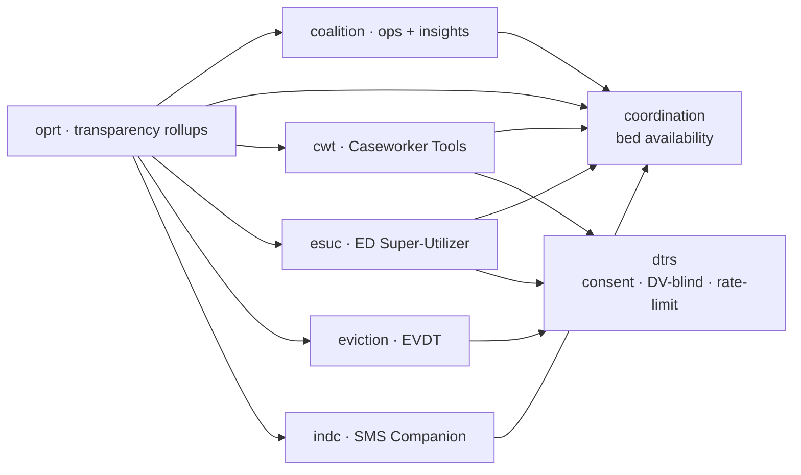
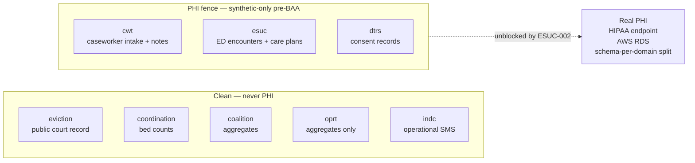
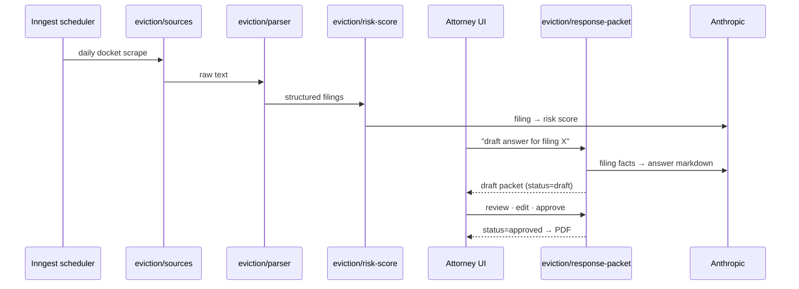
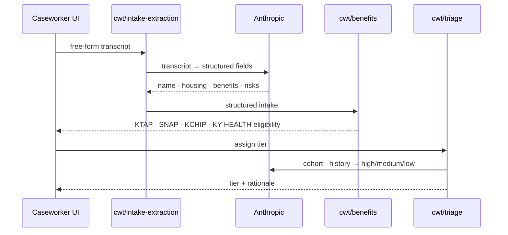
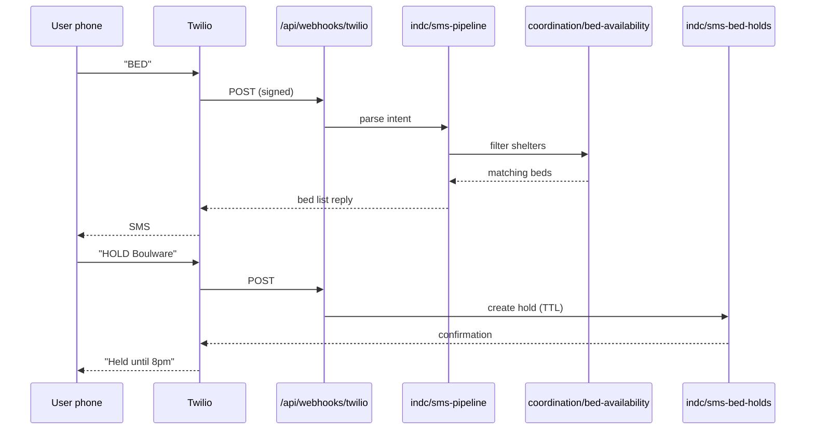

# Architecture — Daviess Coalition Platform

**Audience:** anyone (you, future-you, future-Claude, an eventual second engineer) trying to build a mental map of this codebase in under 10 minutes.

**Stance:** [modular monolith](adr/0001-modular-monolith.md). One Next.js app, one Postgres, eight domain folders, source-level boundaries enforced by `pnpm lint:boundaries`. We split a service only when there's a compliance or scale reason — not because the codebase has multiple domains.

---

## System layers

```mermaid
graph TB
  subgraph ext[External services]
    clerk[Clerk Auth]
    twilio[Twilio SMS]
    anthropic[Anthropic API]
    resend[Resend Email]
    inngest[Inngest Jobs]
  end

  subgraph app[Next.js app]
    routes[App routes / pages<br/>src/app/]
    actions[Server actions<br/>src/app/actions/]
    domains[Domain logic<br/>src/lib/{domain}/]
    prompts[AI prompts<br/>src/ai/prompts/]
    queries[DB queries<br/>src/db/queries/]
    schema[DB schema<br/>src/db/schema/]
  end

  pg[(Postgres<br/>Supabase → AWS RDS post-BAA)]

  clerk --> routes
  twilio --> routes
  routes --> actions
  actions --> domains
  domains --> prompts
  domains --> anthropic
  domains --> queries
  queries --> schema
  schema --> pg
  inngest --> domains
  domains --> resend
```

**Reading the layers:**
- **Routes + actions** = composition layer. Allowed to span domains; that's their job.
- **`src/lib/{domain}/`** = domain logic. Cross-domain imports are gated by ADR 0001.
- **`src/ai/prompts/`** = single source of truth for AI surfaces. No inline prompt strings anywhere else.
- **`src/db/{schema,queries}/`** = persistence. Drizzle ORM; flat schema today, schema-per-domain split deferred to ESUC-002.

---

## Domain dependency graph



Mirrors the allow-list in `scripts/check-domain-boundaries.mts`. Anything not on this graph that tries to import across domains fails CI.

**Two leaf domains:** `coordination` (bed availability) and `dtrs` (consent + access policy). Everything else either consumes them or rolls up into `oprt`.

**Why `oprt` reaches into everything:** transparency / quarterly narrative is a read-only consumer of every domain's output. That's the one place the dependency graph fans wide on purpose.

---

## PHI fence



**The rule** (per [global CLAUDE.md](../CLAUDE.md#the-hipaa--phi-fence--do-not-cross-it)):
- Pre-BAA: no real PHI in DB or AI prompts. Synthetic-only for `cwt`/`esuc`/`dtrs`.
- ESUC-002 (post-BAA): switches to HIPAA-eligible Anthropic endpoint, splits PHI tables to a dedicated Postgres schema with separate role grants.

**The de-id pipeline (#247)** is the strategic open ticket on this fence — it replaces the synthetic-data stub with a real de-identifier so production PHI can flow through extraction post-BAA.

---

## Phase-1 user journeys

### J1 — KLA attorney: filing → response packet



### J2 — Caseworker: intake → benefits screening (synthetic)



Pre-BAA: every "intake" here is synthetic (CWT-001 generator). Post-BAA: same flow, real client data, HIPAA endpoint.

### J3 — Unhoused individual: SMS bed-finder



Twilio webhook signature verified via `indc/twilio-signature.ts` (S5 e2e). Bed-hold expiration enforced by Inngest scheduler, not a Postgres trigger.

---

## Tech stack reference

| Layer | Choice | Notes |
|---|---|---|
| Framework | Next.js 15 (App Router) + TypeScript strict | |
| ORM | Drizzle | Migrations in `drizzle/migrations/` |
| Auth | Clerk | Org/role-aware; middleware in `src/middleware.ts` |
| Database | Postgres (Supabase → AWS RDS post-BAA) | citext, triggers, RLS later |
| AI | Anthropic Claude (Sonnet 4.6 default) | HIPAA endpoint post-BAA |
| SMS | Twilio | HIPAA-eligible account post-BAA |
| Email | Resend | |
| Background jobs | Inngest | Daily scrapers, hold expiration, digests |
| Maps | Mapbox GL JS | |
| Observability | Sentry + PostHog | |
| Testing | Vitest (unit) + Playwright (e2e) | E2E DB on Docker Postgres |
| Lint | Biome + custom boundary lint | |
| Hosting | Railway (staging) → Vercel + AWS (prod post-BAA) | |

---

## Where to learn more

- **`STATE.md`** — current focus + what's open today.
- **Per-domain `src/lib/{domain}/CLAUDE.md`** — auto-loads when editing in that subdir.
- **`docs/adr/`** — decision records for established patterns.
- **`docs/access-control.md`** — role + partner-org policy details.
- **`docs/schema.md`** — schema-level documentation as it accumulates.
