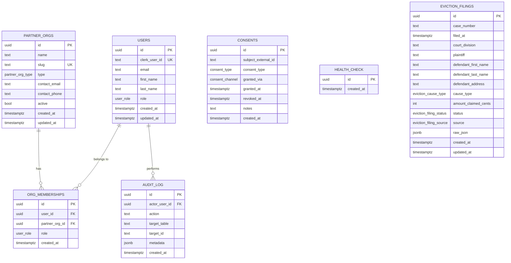

# Database schema

Source of truth: `src/db/schema/*.ts`. Migrations in `drizzle/migrations/`.

## Phase 0 (current)

The Phase-0 schema is intentionally minimal — identity, organizations, audit
log, and consent records. **No client (PHI) data lives in the database yet.**
That comes in Phase 1 stories, gated behind the BAA with Owensboro Health.

## Tables

| Table | Purpose | PHI risk |
|---|---|---|
| `users` | Identity mirror of Clerk users + their primary global role | none |
| `partner_orgs` | Coalition member organizations (hospital, legal aid, shelter, etc.) | none |
| `org_memberships` | M:N user↔org with per-org role for multi-tenant access | none |
| `audit_log` | Append-only record of significant system actions | none — never log PHI in `metadata` |
| `consents` | Subject consent records (PHI sharing, SMS, etc.). Subject linkage is by external ID until clients table lands in Phase 1. | non-PHI |
| `health_check` | DB roundtrip target for `/api/health` | none |
| `eviction_filings` | Public court records of filed eviction cases. Source-tagged so we can land synthetic, manual, and CourtNet rows side-by-side. | non-PHI (public record) |

## Enums

| Enum | Values |
|---|---|
| `user_role` | attorney, caseworker, ed_coordinator, shelter_staff, admin |
| `partner_org_type` | hospital, legal_aid, shelter, community_org, government, other |
| `consent_type` | phi_share_within_coalition, sms_communication, data_for_program_eval |
| `consent_channel` | sms, in_person, web_form, phone, paper |
| `eviction_cause_type` | non_payment, lease_violation, holdover, other |
| `eviction_filing_status` | filed, served, judgment, dismissed, sealed |
| `eviction_filing_source` | courtnet, manual, synthetic |

## Conventions

- All PKs are `uuid` with `default gen_random_uuid()`.
- Timestamps are `timestamp with time zone` and default to `now()`.
- Every FK column has a btree index.
- `audit_log` is append-only — never `UPDATE` or `DELETE` rows. Use
  `logAuditEvent()` from `src/lib/audit.ts` to write.
- `consents` revocations set `revoked_at`; rows are never deleted.
- Schema files live in `src/db/schema/{table}.ts`, exported via `index.ts`.

## Seeding

`pnpm db:seed` creates a baseline of fixture data (1 org + 5 users, one per
role, + 3 audit entries). Idempotent — safe to re-run.
